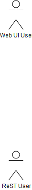

## JPA DAO Model

The JPA DAO model is derived from the following diagrams

DTO classes are at the bottom of the diagram. 
These are simple java beans which are used to pass information between layers.

DAO classes are in the middle of the diagram.
These are used to Create Delete Update and Retrieve (CRUD) data from the database

### User Party Roles - security and login

### Order and Catalog patterns

#### separation of Entity from DTO objects

#### simple version 

## Use Cases and Robustness Diagrams

We can use draw.io https://www.draw.io/ to draw other UML diagrams such as Use Cases, Robustness diagrams and Sequence diagrams. 

The draw.io xml files and their related .png images are in the drawio folder. 

These are also referenced below;

### Use Cases and Robustness Diagrams

### Class Diagrams

## Template use case diagram

## Template Robustness Diagram 

